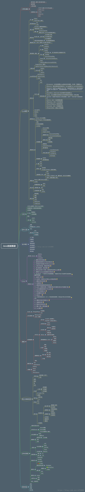

# DailyCoding
 
> - Transfer to Programmer, Keep Learning.
> - Mark's personal study notes, which include:  

## Java

### 基础

> 这一部分是对Java知识的查漏补缺
- Java8
  - [Lambda表达式总结](Java/Java8/Lambda表达式总结.md)
  - [Stream](Java/Java8/Stream.md)
- JVM
  - [Java虚拟机性能监控工具](Java/JVM/Java虚拟机性能监控工具.md)
  - [JVM-1-内存区域与内存管理](Java/JVM/JVM-1-内存区域与内存管理.md)
  - [JVM-2-垃圾收集器与内存分配策略](Java/JVM/JVM-2-垃圾收集器与内存分配策略.md)
  - [JVM-3-类加载机制](Java/JVM/JVM-3-类加载机制.md)
- 异常
  - [Java异常总结](Java/异常/Java异常总结.md)
  - [finally疑难问题](Java/异常/finally疑难问题.md)
- [泛型](Java/泛型/泛型-1-基础总结.md)
- [反射](Java/反射/反射-1-基础.md)
- 集合
  - [C-1-ArrayList](Java/集合/C-1-ArrayList.md)
  - [C-2-LinkedList](Java/集合/C-2-LinkedList.md)
  - [C-3-HashMap](Java/集合/C-3-HashMap.md)
  - [C-4-ConcurrentHashMa](Java/集合/C-4-ConcurrentHashMap.md)
  - [C-5-HashTable](Java/集合/C-5-HashTable.md)
  - [Hash碰撞的解决办法](Java/集合/Hash碰撞的解决办法.md)
  - [HashCode、Equals、HashMap](Java/集合/HashCode、Equals、HashMap.md)
  - [HashMap、HashTable、ConcurrentHashMap对比](Java/集合/HashMap、HashTable、ConcurrentHashMap对比.md)
  - [HashMap为什么不是线程安全的](Java/集合/HashMap为什么不是线程安全的.md)
- [网络编程](Java/网络编程/Java网络编程基础.md)
- [Concurrence](Java/Concurrence)
- NIO
  - [AIO、NIO、BIO区别](Java/NIO/AIO、NIO、BIO区别.md)
  - [NIO-1-基础](Java/NIO/NIO-1-基础.md)
  - [NIO底层原理](Java/NIO/NIO底层原理.md) 
### Leetcode

>Mark的刷题总结，保持更新
- [Practice](/DailyCoding/LeetCode/LeetCode-MarkPractice.md)
- [Attention](/DailyCoding/LeetCode/LeetCode-Attention.md)
### NEU Course

>Mark NEU AED课程的quiz题，已完结
- [Quiz Coding](INFO5100-quizReview.md)
## Data Structure and Algorithms

>基于Java的数据结构和算法总结
>刚开始更新的时候缺少规划，没有分页，所以导致所有的内容都在同一个`Markdown`文件内。
>开头有content，可以检索并直接跳转
- [个人总结](./DataStructure&Algorithm/DataStructuresandAlgorithms.md)
## Front-end / Back-end

>课上讲的和自学的一些前端的知识，保持更新
>- 编程语言
>- 框架｜服务器搭建
- HTML
- CSS
- [JavaScript](Front-end/Web-JavaScript.md)
- [Angular](Front-end/Web-Angular.md)
- [Node.js](Front-end/Web-Node.js.md)

## Java学习路线

 